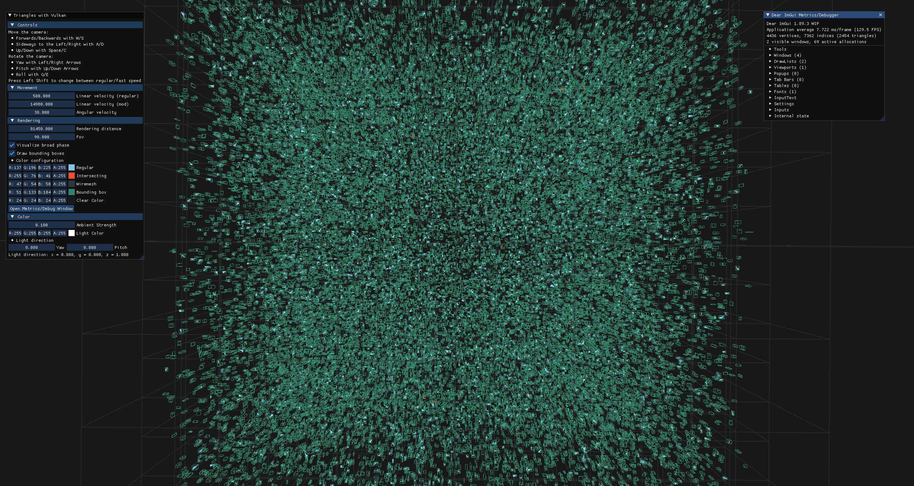
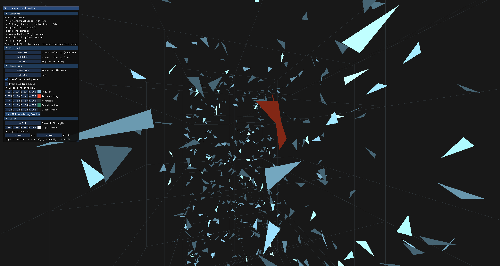
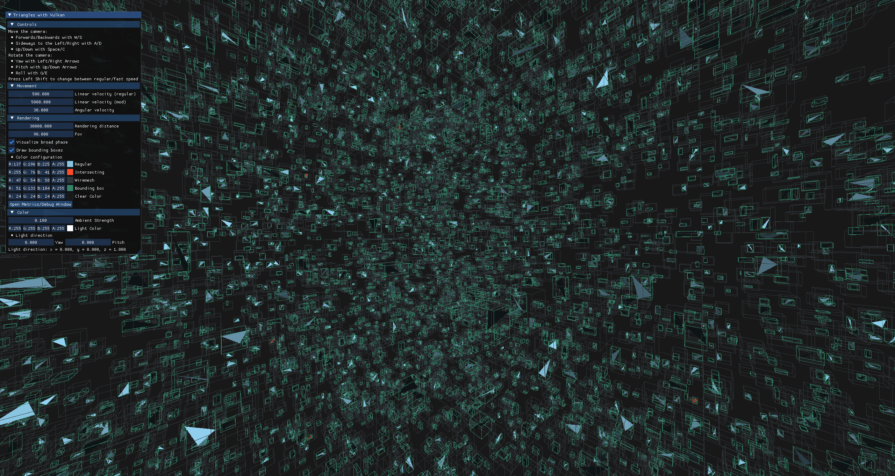

# 3D Triangle intersection Visualization with Vulkan in C++ 

# 1. How to build
## Linux
```sh
git submodule init
git submodule update
cmake -S ./ -B build/ -DCMAKE_BUILD_TYPE=Release
cd build/
make -j12 install
```

# Windows
Try your luck, this application should compile on Windows, but there are no guarantees.

# 2. How to run program
```sh
cd build/
# Available options:
#  -h [ --help ]         Print this help message
#  --broad arg (=octree) Algorithm for broad phase (bruteforce, octree, uniform-grid)
./triangles --broad=uniform-grid < ../../01-hw3d/test/intersect/resources/large0.dat
```

# 3. Preview
<!-- Some beautiful screenshotes there -->

## Configure runtime parameters:

Variables such as colors of different objects, lighting intensity as well as color and direction can be configured through the GUI implemented with [Dear ImGui](https://github.com/ocornut/imgui).




## Try out different broad phase datastructures:
```sh
./triangles --broad=uniform-grid < ../../01-hw3d/test/intersect/resources/medium0.dat
```


